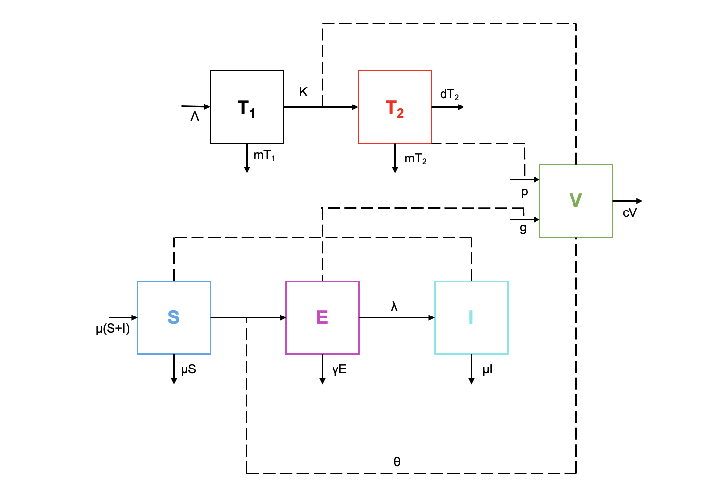

Considera una enfermedad infecciosa impulsada por factores ambientales, como el cólera y la toxoplasmosis (una enfermedad parasitaria causada por *T.* *gondii*). Para este tipo de enfermedad, la transmisión ocurre cuando los huéspedes susceptibles tienen contacto con un entorno contaminado, y la tasa de contaminación del entorno depende tanto del número de huéspedes infectados como de la carga patógena promedio dentro de un huésped infectado. Una forma de modelar la dinámica de transmisión para tal enfermedad es considerar tanto la transmisión de la enfermedad a nivel de la población como el proceso de infección dentro de los huéspedes.

$$\dot T_1 = \Lambda -kVT_1 -mT$$ $$\dot T_2= kVT -(m+d)T_2$$ $$ \dot V= g(E) +pT_2-cV$$ $$ \dot S= \mu(S+I) -\lambda ES -\mu S$$ $$\dot I =\lambda ES -\mu I$$

$$ \dot E= \theta(V)I(1-E) -\gamma E$$

Las variables $T_1,T_2, V$ son las densidades de células sanas, infectadas y carga parasitaria, respectivamente.

### 1. Dibuja un esquema por compartimentos de este modelo



### 2. Describe el resto de las ecuaciones y parámetros. ¿Qué son $g(E)$ y $\theta(V)$ ?

-   $T_1$: Densidad de células sanas:
    -   $\Lambda$ : Tasa de surgimiento de nuevas células.
    -   $-kVT_1$ : Tasa de infectividade de células sanas, depende de la carga parasitaria.
    -   $-mT_1$ : Tasa de muerte celular normal de células sanas.
-   $T_2$: Densidad de células infectadas:
    -   $kVT_1$ : Tasa de infectividade de células sanas, depende de la carga parasitaria.
    -   $-mT_2$ : Tasa de muerte celular normal de células infectadas
    -   $-dT_2$ : Tasa de muerte celular de células infectadas (por sistema inmune).
-   $V$: Carga parasitaria:
    -   $g(E)$ : Tasa de reproducción de parásitos en individuos expuestos.
    -   $pT_2$ : Tasa de transmisión del parásito entre células del huésped.
    -   $-cV$ : Tasa de muerte de los parásitos.
-   $S$: Individuos susceptibles:
    -   $\mu S$ : Tasa de nacimiento de individuos susceptibles.
    -   $\mu I$ : Tasa de individuos infectados que pueden seguir infectándose.
    -   $-\lambda ES$ : Tasa de infección/interacción entre individuos susceptibles e individuos expuestos.
    -   $-mS$: Tasa de muerte de individuos susceptibles.
-   $I$: Individuos infectados:
    -   $\lambda ES$ : Tasa de infección/interacción entre individuos susceptibles e individuos expuestos.
    -   $-mI$: Tasa de muerte de individuos infectados.
-   $E$: Individuos expuestos:
    -   $\theta (E) I (1-E)$ : Tasa de interacción con el entorno contaminado, dependiendo de la proporción de individuos infectados.
    -   $-\gamma E$ : Tasa de muerte de individuos expuestos.

### 3. Justifica porque es un buen sistema de ecuaciones para describir el problema

Porque no toma en consideración a la población total de individuos, sino también a cada individuo y lo que lo compone (células), ya que no es lo mismo estar infectado con una baja carga parasitaria, que estar infectado con una alta carga parasitaria.

También porque toma en cuenta las tasas de crecimiento de los parásitos, que varían entre grupos [de parásitos] y de sus ciclos de vida.

### 4. Resuelve numéricamente este sistema en R.

```{r}
library (deSolve) 

EIDA <- function (time, state, parameters) {
  with (as.list (c (state, parameters)), {
    dT1 <- Lambda - k * V * T1 - m1 * T1
    dT2 <- k * V * T1 - m2 * T2 - d * T2
    dV <- g * E + p * T2 - c * V
    dS <- nS * S + nS * I - lambda * E * S - muS * S 
    dI <- lambda * E * S - muI * I 
    dE <- theta * V * I * (1 - E) - gamma * E
    list (c (dT1, dT2, dV, dS, dI, dE)) 
  })
}

parameters <- c (Lambda = 0.9, k = 0.02, m1 = 0.01, m2 = 0.05, d = 0.08, g = 0.001, p = 0.7, c = 0.2, nS = 0.0085, lambda = 0.5, muS = 0.01, muI = 0.04, theta = 0.5, gamma = 0.02)
initial_conditions <- c (T1 = 1000, T2 = 50, V = 30, S = 1000, I = 50, E = 100) 
time <- seq (0, 100, by = 0.001)
out <- ode (initial_conditions, time, EIDA, parameters)

matplot (out [ , 1], out [ , 2 : 7], type = "l", xlab = "TIEMPO", ylab = "POBLACIÓN", main = "MODELO ENFERMEDAD INFECCIOSA 
DETERMINADA POR EL AMBIENTE (0-100)", lwd = 3)
legend ("topright", c ("CÉLULAS SANAS", "CÉLULAS INFECTADAS", "CARGA PARASITARIA", "SUSCEPTIBLE", "INFECTADO", "EXPUESTO"), col = 1 : 7, lty = 1 : 7, cex = 0.5)

parameters <- c (Lambda = 0.9, k = 0.02, m1 = 0.01, m2 = 0.05, d = 0.08, g = 0.001, p = 0.7, c = 0.2, nS = 0.0085, lambda = 0.5, muS = 0.01, muI = 0.04, theta = 0.5, gamma = 0.02)
initial_conditions <- c (T1 = 1000, T2 = 50, V = 30, S = 1000, I = 50, E = 100) 
time <- seq (0, 50, by = 0.001)
out <- ode (initial_conditions, time, EIDA, parameters)

matplot (out [ , 1], out [ , 2 : 7], type = "l", xlab = "TIEMPO", ylab = "POBLACIÓN", main = "MODELO ENFERMEDAD INFECCIOSA 
DETERMINADA POR EL AMBIENTE (0-50)", lwd = 3)
legend ("topright", c ("CÉLULAS SANAS", "CÉLULAS INFECTADAS", "CARGA PARASITARIA", "SUSCEPTIBLE", "INFECTADO", "EXPUESTO"), col = 1 : 7, lty = 1 : 7, cex = 0.5)

parameters <- c (Lambda = 0.9, k = 0.02, m1 = 0.01, m2 = 0.05, d = 0.08, g = 0.001, p = 0.7, c = 0.2, nS = 0.0085, lambda = 0.5, muS = 0.01, muI = 0.04, theta = 0.5, gamma = 0.02)
initial_conditions <- c (T1 = 1000, T2 = 50, V = 30, S = 1000, I = 50, E = 100) 
time <- seq (0, 20, by = 0.001)
out <- ode (initial_conditions, time, EIDA, parameters)

matplot (out [ , 1], out [ , 2 : 7], type = "l", xlab = "TIEMPO", ylab = "POBLACIÓN", main = "MODELO ENFERMEDAD INFECCIOSA 
DETERMINADA POR EL AMBIENTE (0-20)", lwd = 3)
legend ("topright", c ("CÉLULAS SANAS", "CÉLULAS INFECTADAS", "CARGA PARASITARIA", "SUSCEPTIBLE", "INFECTADO", "EXPUESTO"), col = 1 : 7, lty = 1 : 7, cex = 0.5)

```

Al final, por los valores de los parámetros utilizados, la carga parasitaria será mayor a cualquier otra variable; sin embargo, no más que el total de células tanto infectadas como sanas. Y tiene sentido, pues se tienen más parásitos y células, que individuos.
