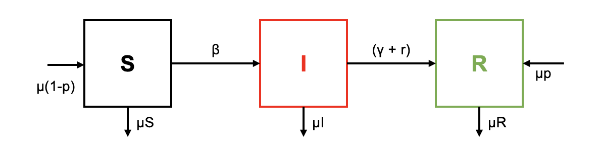

Considera una población en la cual una fracción $p \in (0, 1 )$ de los recién nacidos son exitosamente vacunados y asume inmunidad permanente después de la infección y la vacunación. Supongamos que los individuos infecciosos son tratados a una tasa per cápita $r$. Sea $R_c$ el número de reproducción de control tal que el equilibrio libre de enfermedad es asintóticamente estable cuando $R_c < 1$. Considera una enfermedad para la cual $\beta = 0.86$, $\gamma = 1/14$ $días^{-1}$, $\mu = 1/75$ $años^{−1}$. Usa el siguiente modelo SIR para calcular el nivel de inmunidad umbral $p_c$ tal que $R_c < 1$ para $p > p_c$.

$$\dot S = \mu N(1-p)-\beta S\frac{I}{N} -\mu S$$ $$\dot I = \beta S\frac{I}{N} -(\gamma  +\mu +r) I$$ $$\dot R =\mu N p +(\gamma + r)I-\mu R$$ con $$N=S+I+R$$

### 1. Dibuja un esquema por compartimentos de este modelo



### 2. Justifica porque es un buen sistema de ecuaciones para describir el problema

Porque se tiene en cuenta que hay una proporción de la población recién nacida que no se va a vacunar. Y porque la tasa de recuperación y de tratamiento no son lo mismo, entoces es bueno separar los valores.

### 3. Encuentra $p_c$ en ausencia de tratamiento ($r=0$)

$$R_0 = \beta / (\gamma + r)$$ Entonces: $$0.86 / (0.071 + 0) = 12.113$$ $$p_c = 1 - (1/12.113) = 0.9174$$ Por lo tanto, el nivel de inmunidad umbral sería cuando el 91.74% de la población esté inmunizada.

### 4. Encuentra $p_c$ con $r=0.2$

$$R_0 = \beta / (\gamma + r)$$ Entonces: $$0.86 / (0.071 + 0.2) = 3.1734$$ $$p_c = 1 - (1/3.1734) = 0.68.46$$ Por lo tanto, el nivel de inmunidad umbral será cuando el 68.46% de la población esté inmunizada, mucho menor que cuando no se tiene tratamiento.

### 5. Resuelve numéricamente este sistema en R.

```{r}
library (deSolve) 

SIR <- function (time, state, parameters) {
  with (as.list (c (state, parameters)), {
    dS <- mu * (S + I + R) * (1 - p) - beta * S * I / (S + I + R) - mu * S
    dI <- beta * S * I / (S +I + R) - gamma * I - r * I - mu * I
    dR <- mu * (S + I + R) * p + gamma * I + r * I - mu * R
    list (c (dS, dI, dR)) 
  })
}

parameters <- c (mu = 0.05, p = 0.5, beta = 0.86, gamma = 0.071, r = 0, mu = 0.0000365)
initial_conditions <- c (S = 1000, I = 100, R = 500) 
time <- seq (0, 100, by = 0.001)
out <- ode (initial_conditions, time, SIR, parameters)

matplot (out [ , 1], out [ , 2 : 4], type = "l", xlab = "TIEMPO", ylab = "POBLACIÓN", main = "MODELO VACUNACIÓN Y VALOR UMBRAL
r = 0", lwd = 3)
legend ("topright", c ("SUSCEPTIBLE", "INFECTADO", "RECUPERADO"), col = 1 : 4, lty = 1 : 4, cex = 0.5)


SIR <- function (time, state, parameters) {
  with (as.list (c (state, parameters)), {
    dS <- mu * (S + I + R) * (1 - p) - beta * S * I / (S + I + R) - mu * S
    dI <- beta * S * I / (S +I + R) - gamma * I - r * I - mu * I
    dR <- mu * (S + I + R) * p + gamma * I + r * I - mu * R
    list (c (dS, dI, dR)) 
  })
}

parameters <- c (mu = 0.05, p = 0.5, beta = 0.86, gamma = 0.071, r = 0.2, mu = 0.0000365)
initial_conditions <- c (S = 1000, I = 100, R = 500) 
time <- seq (0, 100, by = 0.001)
out <- ode (initial_conditions, time, SIR, parameters)

matplot (out [ , 1], out [ , 2 : 4], type = "l", xlab = "TIEMPO", ylab = "POBLACIÓN", main = "MODELO VACUNACIÓN Y VALOR UMBRAL
r = 0.2", lwd = 3)
legend ("topright", c ("SUSCEPTIBLE", "INFECTADO", "RECUPERADO"), col = 1 : 4, lty = 1 : 4, cex = 0.5)

```

Cuando se tiene un proceso de tratamiento, el número de individuos recuperados es mucho mayor y el de infectados, menor, en menor tiempo.
