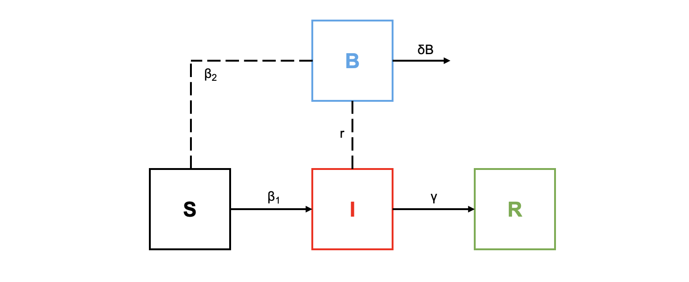

Algunas enfermedades pueden propagarse de más de una manera. Por ejemplo, el cólera puede transmitirse de persona a persona, pero también puede transmitirse indirectamente a través de un patógeno liberado por personas infectadas a través de un medio como agua contaminada. Considera un modelo epidémico con transmisión directa (de persona a persona) e indirecta (a través de un medio como agua contaminada). A un modelo S I R simple le agregamos un patógeno $B$ liberado por personas infectadas. Suponemos que la infectividad del patógeno es proporcional a su concentración. El modelo resultante es:

$$ \dot S= -\beta_1SI -\beta_2 SB$$ $$\dot I =  \beta_1SI + \beta_2 SB -\gamma I$$

$$\dot R =\gamma I$$

$$\dot B = rI -\delta B$$

con $N=S+I+R$

### 1. Dibuja un esquema por compartimentos de este modelo



### 2. Justifica porque es un buen sistema de ecuaciones para describir el problema

Porque se considera tanto la interacción con individuos infectados, como con el patógeno libre y que los valores de $\beta$ no son iguales. Yo agregaría demografía (tasas de nacimiento y muerte) para los individuos y para el patógeno.

### 3. Justifica porque la siguiente expresión puede ser un buen $R_0=\frac{\beta_1 N}{\gamma} +\frac{r\beta_2 N}{\gamma \delta}$

Porque $R_0 = Favorece / desfavorece$ (infección), entonces:

-   $\beta_1 * N$ : Tasa de infección entre individuos.

-   $r* \beta_2 * N$: Tasa de liberación de patógeno al ambiente y de infección a través del patógeno libre.

-   $\gamma$: Tasa de recuperación por infección entre individuos.

-   $\gamma * \delta$: Tasa de recuperación y de eliminación del patógeno del medio.

Entonces, sí favorecen las tasas de infección y desfavorecen las tasas de recuperación, tanto entre individuos, como por el patógeno libre.

### 4. Resuelve numéricamente este sistema en R para valores de $R_0 >1$ y $R_0 <1$ Discute tus resultados.

```{r}
library (deSolve) 

SIRB <- function (time, state, parameters) {
  with (as.list (c (state, parameters)), {
    dS <- - beta1 * S * I - beta2 * S * B
    dI <- beta1 * S * I + beta2 * S * B - gamma * I
    dR <- gamma * I 
    dB <- r * I - delta * B
    list (c (dS, dI, dR, dB)) 
  })
}

parameters <- c (beta1 = 0.09, beta2 = 0.05, gamma = 0.07, r = 0.02, delta = 0.4)
initial_conditions <- c (S = 1000, I = 100, R = 500, B = 5000) 
time <- seq (0, 100, by = 0.001)
out <- ode (initial_conditions, time, SIRB, parameters)

matplot (out [ , 1], out [ , 2 : 5], type = "l", xlab = "TIEMPO", ylab = "POBLACIÓN", main = "MODELO TRANSMISIÓN DIRECTA E INDIRECTA
(0-100)", lwd = 3)
legend ("topright", c ("SUSCEPTIBLE", "INFECTADO", "RECUPERADO", "PATÓGENO"), col = 1 : 5, lty = 1 : 5, cex = 0.5)

parameters <- c (beta1 = 0.09, beta2 = 0.05, gamma = 0.07, r = 0.02, delta = 0.4)
initial_conditions <- c (S = 1000, I = 100, R = 500, B = 5000) 
time <- seq (0, 40, by = 0.001)
out <- ode (initial_conditions, time, SIRB, parameters)

matplot (out [ , 1], out [ , 2 : 5], type = "l", xlab = "TIEMPO", ylab = "POBLACIÓN", main = "MODELO TRANSMISIÓN DIRECTA E INDIRECTA
(0-40)", lwd = 3)
legend ("topright", c ("SUSCEPTIBLE", "INFECTADO", "RECUPERADO", "PATÓGENO"), col = 1 : 5, lty = 1 : 5, cex = 0.5)
```

Debido a que el modelo no tiene demografía y a los valores de los parámetros propuestos, después de x tiempo, los infectados y el patógeno tienden a 0, sin embargo, todos los individuos pasan a ser recuperados.
